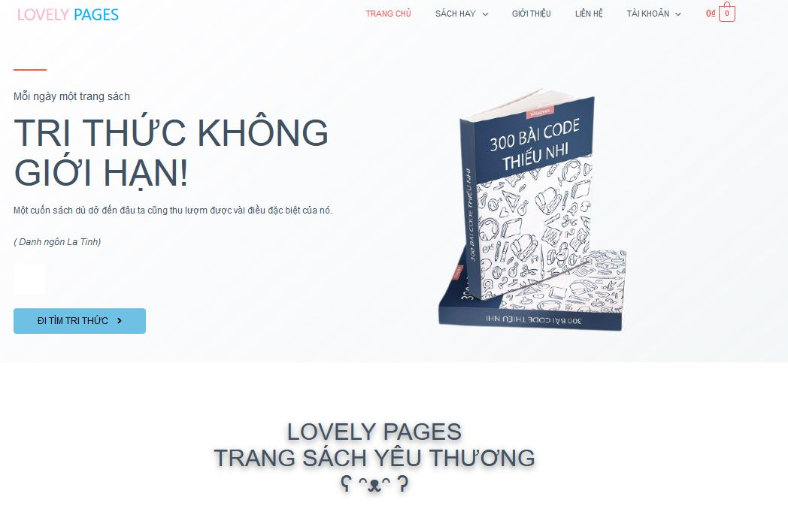
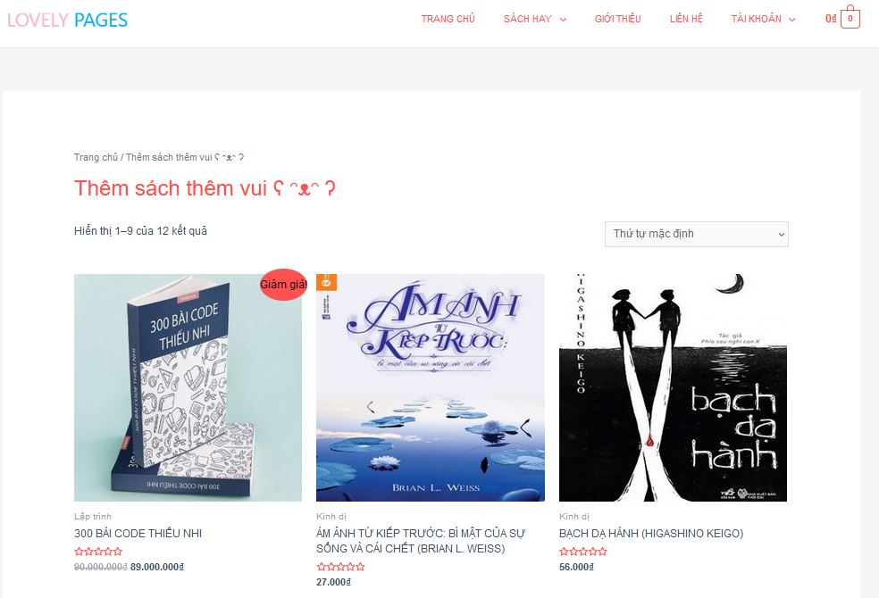
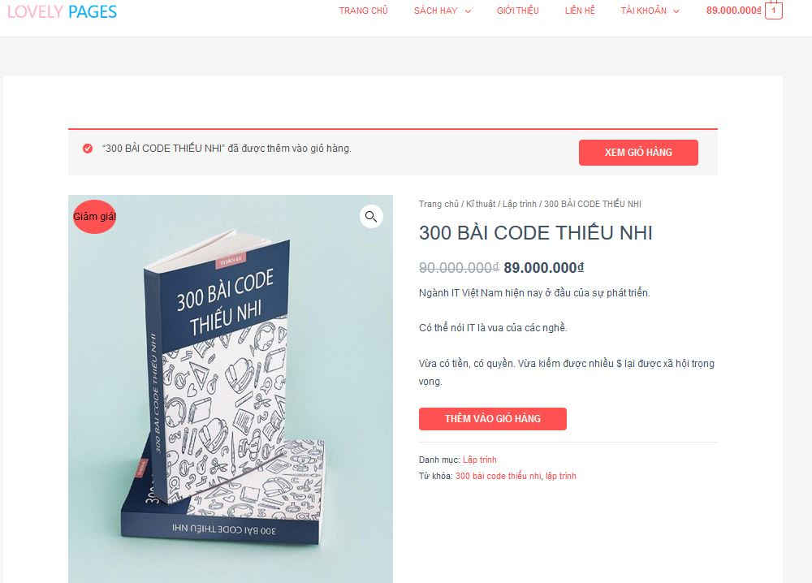
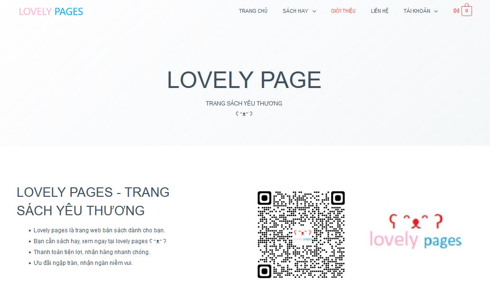
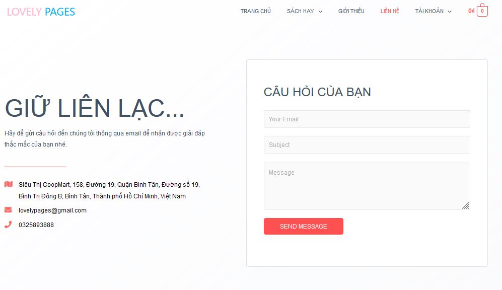
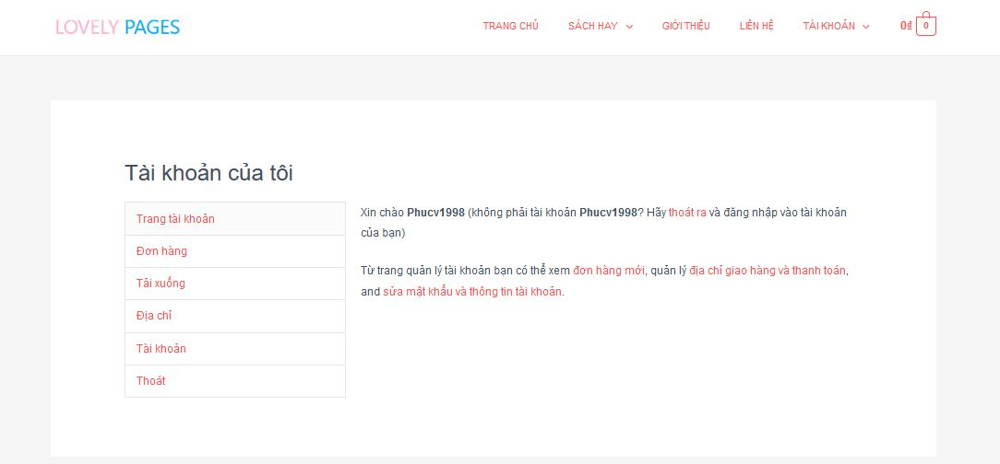
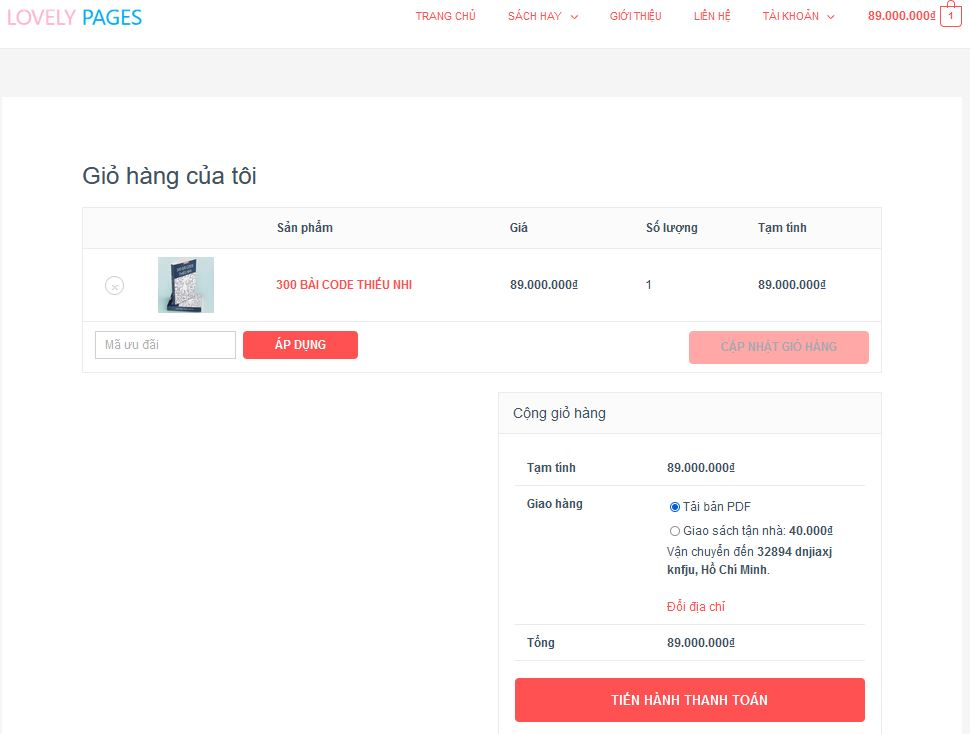
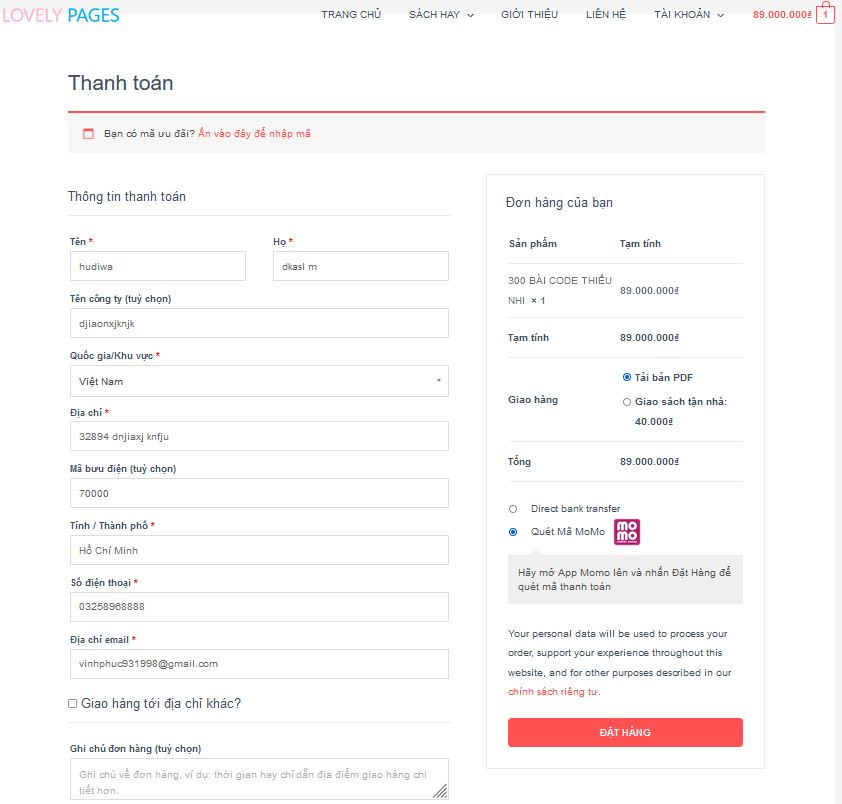

# ĐỒ ÁN THƯƠNG MẠI ĐIỆN TỬ - WORDPRESS

## 1. Trong Git này gồm: 
1. Toàn bộ thư mục của htdocs // chứa code của trang WordPress
2. 1 File rar `ThuongMaiDienTu_WP` là bản rút gọn cho việc upload host. Bạn lấy file này up lên host luôn cho tiện, mình làm sẵn rồi đó ʕ ᵔᴥᵔ ʔ
3. File Database MySQL `epiz_29466718_lovelypages.sql`
4. Demo page: [Lovely pages - Trang sách yêu thương](http://lovelypages.lovestoblog.com/) 
`Link này demo free nên nó có thể die bất cứ lúc nào`
5. Cách upload host: [Youtube tutorial in VietNamese](https://youtu.be/9tG3CUERl_Y)
6. Có 2 file ngoài ko liên quan là 1 file `readme.md` với folder `ReadMepics` là để làm cái note giới thiệu trên `Github` này. Bạn có thể xoá nó khi tải về.
7. Tài khoản `wp-admin` thì bạn [inbox mình]([https://link](https://www.facebook.com/hitoshi.itamino/)) để biết nha ʕ ᵔᴥᵔ ʔ

## 2. Chức năng chính của đồ án:
1. Đăng nhập bằng tài khoản **Google**
2. Thanh toán bằng:
   1. Chuyển khoản qua ngân hàng truyền thống
   2. Thanh toán qua app momo
3. Cho phép tải sách Ebook nếu mua sách online
4. Cũng có thể lựa chọn giao sách tại nhà

## 3. Hình ảnh demo trang web:
1. Trang chủ

2. Trang sản phẩm

3. Trang chi tiết sản phẩm

4. Trang giới thiệu

5. Trang liên hệ

6. Trang tài khoản

7. Trang giỏ hàng của tôi (My cart)

8. Trang thanh toán

----------
##### ʕ ᵔᴥᵔ ʔ CHÚC CÁC BẠN VUI VẺ ʕ ᵔᴥᵔ ʔ

----------
